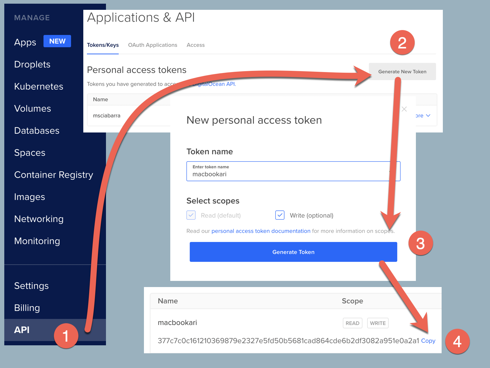
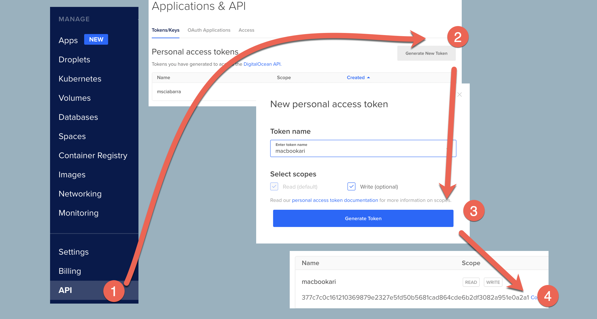
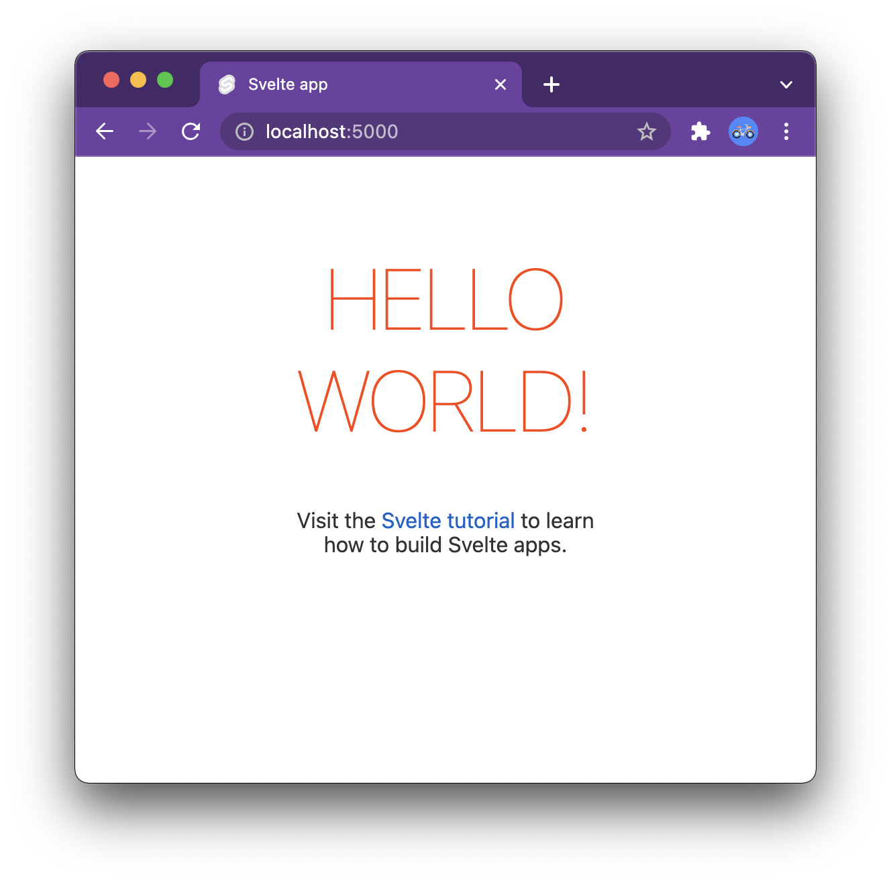

# **App Platform**
## Step by Step

Building a simple but complete application with Node in App Platform

https://www.digitalocean.com

---
# Agenda

- Installing the cli
  - https://docs.digitalocean.com/reference/doctl/how-to/install/
- Develop the Front-End
  - Provision a static site
- Implement the Api
  - Provision a node backed
- Setup storage
  - Provision a database

---


---
# Get your token

- Install the `doctl` cli
- Click on **API** on Menu
- Click on **Generate New Token**
- Click on **Generate Token**
- Click on **Copy** 
- Type `doctl auth init` and paste



---


---


---
# Creating a frontend

- An example using Svelte
`npx degit sveltejs/template frontend`

- Install it
`cd frontend && npm install`
- Run in development mode
`npm run dev`



---
# Deployment: `.do/app.yaml`

```yaml
name: tutorial-app-platform
static_sites:
- name: frontend
  github:
    repo: sciabarrado/tutorial-app-platform
    branch: main
    deploy_on_push: true
  build_command: npm run build
  source_dir: frontend
  routes:
  - path: /
```
- Deploy with: `doctl app create --spec .do/app.yaml`

---
# <!--!--> Exercise: deploy frontend
```sh
# creating the frontend
npx degit sveltejs/template frontend
cd frontend && npm install 
npm run dev
# deploying the frontend
mkdir .do
cp src/1-app.yaml .do/app.yaml
doctl app create --spec .do/app.yaml
# monitoring
ID=$(doctl app list | awk '/tutorial-app-platform/ { print $1}')
echo $ID
doctl app logs $ID
```

---


---
# Simple Backend Code

```js
const express = require('express')
const app = express()
const port = 8080

app.get('/', (req, res) => {
  res.send('Hello World!')
})

app.listen(port, () => {
  console.log(`App listening at http://localhost:${port}`)
})
```

---
# <!--!--> Creating the backend
```sh
mkdir backend ; cd backend
npm -y init
npm install --save express
cp ../src/2-index.js index.js
node index.js
```

---
# Backend deployment

```yaml
services:
- name: backend
  github:
    repo: sciabarrado/tutorial-app-platform
    branch: main
    deploy_on_push: true
  run_command: node index.js
  source_dir: backend
  routes:
  - path: /api
```

---
# <!--!--> Exercise: backend 
```sh
# new configuration
cd ..
cp src/2-app.yaml .do/app.yaml
# update
ID=$(doctl app list | awk '/tutorial-app-platform/ { print $1}')
echo $ID
doctl app update $ID --spec .do/app.yaml
```

---


---
# <!--!--> Exercise: create database locally
```sh
# create the user 
psql postgres -U postgres
create user demo with password 'demo';
create database localdb with owner = 'demo';
quit
# configure the environment variables
export PGHOST=localhost
export PGPORT=5432
export PGDATABASE=localdb
export PGUSER=demo
export PGPASSWORD=demo
# check the connection
psql -h $PGHOST -p $PGPORT -U $PGUSER $PGDATABASE
```

---
# <!--!--> Connect to database with node
```sh
# install driver
cd backend
npm install pg --save
node --experimental-repl-await
# test database connection
const { Client } = require('pg')
const client = new Client()
await client.connect()
let create = `
CREATE TABLE IF NOT EXISTS guestbook( 
   id SERIAL PRIMARY KEY,
   message TEXT)`
const res = await client.query(create)
```

---
# Connecting to the database

```js
const { Client } = require('pg')


function start() {
  console.log("connecting to database")
  let client = new Client()
  client.connect()
    .then(() => init(client))
    .catch((err) => {
      console.log(err)
      setTimeout(start, 2000)
    })
}
```

---
# Initializing the database

```js
let create = `
CREATE TABLE IF NOT EXISTS guestbook( 
   id SERIAL PRIMARY KEY,
   message TEXT
)`

function init(client) {
  client.query(create)
    .then(() => app.listen(port))
    .then(() => console.log(`App listening a at ${port}`))
    .catch(console.log)
}
```

---
# Provisioning a database

```yaml
databases:
- name: db
  engine: PG
  version: "12"
```

- Development database
  - do not use in production

---
### Connecting to the database
```yaml
  # add parameters to connect to database
  envs:
    - name: PGHOST
      value: ${db.HOSTNAME}
    - name: PGPORT
      scope: RUN_TIME
      value: ${db.PORT}
    - name: PGDATABASE
      scope: RUN_TIME
      value: ${db.DATABASE}
    - name: PGUSER
      scope: RUN_TIME
      value: ${db.USERNAME}
    - name: PGPASSWORD
      scope: RUN_TIME
      value: ${db.PASSWORD}
```

---
# <!--!--> Exercise: deployment database
```sh
cp src/3-app.yaml .do/app.yaml 
cp src/3-index.js backend/index.js
# update
ID=$(doctl app list | awk '/tutorial-app-platform/ { print $1}')
echo $ID
doctl app update $ID --spec .do/app.yaml
```

---


---
```
// insert
let msg = "hello"
client.query(`
  INSERT INTO guestbook(message) 
  VALUES(?)", [msg])
// select
```
