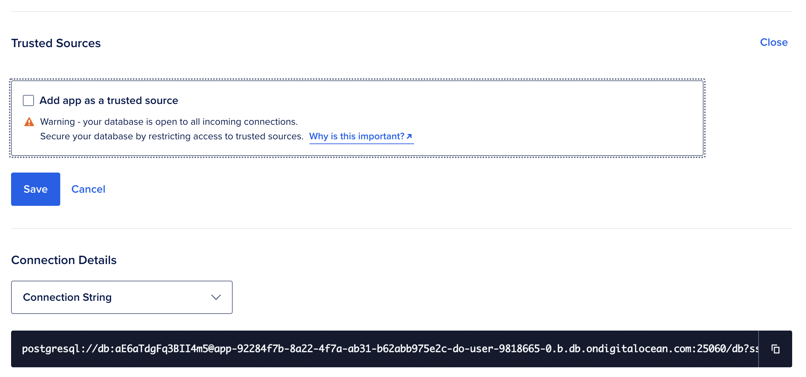
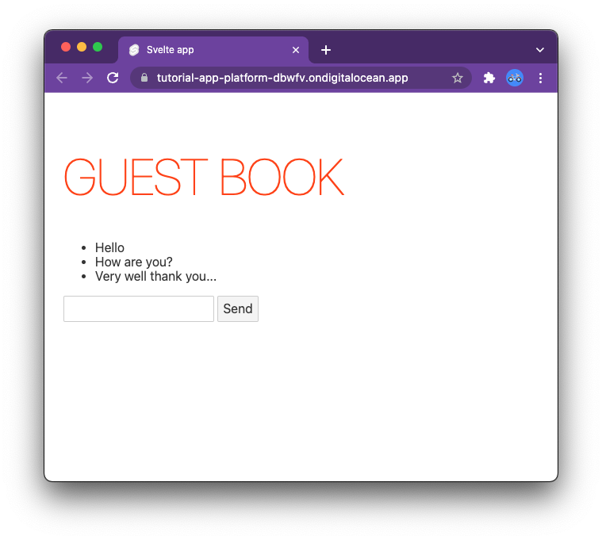

# **App Platform**
## Step by Step

Building a simple but complete application with Node.js 

https://www.digitalocean.com

---
# What we are going to do today?

- Develop a **front-end**
  - Deployed in a static site
- Implement a **back-end API**
  - Provisioned as backend service
- Add persistence with a **database** 
  - Provisioning a Postgresql Databse
- Develop freely with continuous updates!

---


---
# Preparation

## Register for a free account

- You will get access to Atlantis

## Install the cli `doctl`

https://docs.digitalocean.com/reference/doctl/how-to/install/

- Available for Windows, Mac and Linux

---
# Get your token

- Install the `doctl` cli
- Click on **API** on Menu
- Click onq **Generate New Token**
- Click on **Generate Token**
- Click on **Copy** 
- Type `doctl auth init` and paste


---


---


---
# Creating a frontend

- An example using Svelte
`npx degit sveltejs/template frontend`

- Install it
`cd frontend && npm install`
- Run in development mode
`npm run dev`


---
# <!--!--> Exercise: create the frontend
```sh
# creating the frontend
npx degit sveltejs/template frontend
cd frontend && npm install 
npm run dev
# interrupt
cd ..
```

---
# Concepts of App Platform / 1

- Your deployment is the `.do/app.yaml`
- It includes lots of components:
  - **static sites**
  - services 
  - databases
  - routes
  - and much more...

---
# Concepts of App Platform / 2

- The YAML describes the complete cycle:
 - **1** Pulling from repositoryes
 - **2** Building applications
 - **3** Exposing to the internet

# Deployment
 - Deploy with: `doctl app create --spec .do/app.yaml`

---
# Deployment: `.do/app.yaml`

```yaml
name: tutorial-app-platform
static_sites:
- name: frontend
  # 1 pulling from repositories
  github:
    repo: sciabarrado/tutorial-app-platform
    branch: main
    deploy_on_push: true
  # 2 building applications
  build_command: npm run build
  source_dir: frontend
  # 3 exposing to the internet
  routes:
  - path: /
```

---
# <!--!--> Exercise: deploy frontend
```sh
# deploying the frontend
mkdir .do
cp src/1-app.yaml .do/app.yaml
git add frontend 
git commit -m "frontend" -a
git push origin main
doctl app create --spec .do/app.yaml
# monitoring
ID=$(doctl app list | awk '/tutorial-app-platform/ { print $1}')
echo $ID
doctl app logs $ID --type build -f
doctl app list
```

---


---
# Let's build our backend
- We are going to use **Node.js**
  - you can use also out of the box Python, PHP, Golang, Ruby
  - You can also use "*whatever*" thanks to Dockerfile
    - you need a bit more knowledge here
- Builds are automated thanks to "buildpack"
  - they can build your code *automagicallly*  in many common cases

---
# Simple Backend Code `node.js`

```js
const express = require('express')
const app = express()
const port = 8080

app.get('/', (req, res) => {
  res.send('Hello World!')
})

app.listen(port, () => {
  console.log(`App listening at http://localhost:${port}`)
})
```

---
# <!--!--> Creating the backend
```sh
# a new directory for backend
mkdir backend 
cd backend
# mandatory initializations
npm -y init
npm install --save express
# using our examples here
cp ../src/2-index.js index.js
node index.js
# interrupt
cd ..
```

---
# Deploying the backed with `app.yaml`

- Adding a `services` section
- same steps as before:
  - **1** pull
  - **2** build (automated)
  - **3** expose to internet
- Additional step:
  - **4** run your code

---
# Backend deployment

```yaml
services:
- name: backend
  # 1 pull
  github:
    repo: sciabarrado/tutorial-app-platform
    branch: main
    deploy_on_push: true
  source_dir: backend
  # 2 build is autodetected
  # 3 expose to internet
  routes:
  - path: /api
  # 4 run your code
  run_command: node index.js
```

---
# <!--!--> Exercise: deploy backend 
```sh
# new configuration
cp src/2-app.yaml .do/app.yaml
git add backend
git commit -m "backend" -a
git push origin main
# update
ID=$(doctl app list | awk '/tutorial-app-platform/ { print $1}')
echo $ID
doctl app update $ID --spec .do/app.yaml
doctl app logs $ID --type build -f
doctl app list
```

---


---
# What you need to know about the database
- It is automated provisioned:
  - just add it to the `app.yaml`
- Available:
  - SQL: `postgresql`, `mysql`
  - NoSQL: `redis`, `mongodb`
- You need to use environment variables to connect to it

---
# Environment variables PostgreSQL

- `PGHOST`, `PGPORT`
  - hostname and port of the database
- `PGUSER`, `PGPASSWORD`
  - username and password
- `PGDATABASE`,  `PGSSLMODE`
  - database name
  - *important* you may need  `PGSSLMODE=no-verify`


---
# <!--!--> Exercise: create database locally
```sh
# create the user 
psql postgres -U postgres
create user demo with password 'demo';
create database localdb with owner = 'demo';
quit
# configure the environment variables
export PGHOST=localhost
export PGPORT=5432
export PGDATABASE=localdb
export PGUSER=demo
export PGPASSWORD=demo
# check the connection
psql -h $PGHOST -p $PGPORT -U $PGUSER $PGDATABASE
```

---
# <!--!--> Connect to database with node
```sh
# install driver
cd backend
npm install pg --save
node --experimental-repl-await
# test database connection
const { Client } = require('pg')
const client = new Client()
await client.connect()
let create = `
CREATE TABLE IF NOT EXISTS guestbook( 
   id SERIAL PRIMARY KEY,
   message TEXT)`
const res = await client.query(create)
# exit and check if the table is there
psql -h $PGHOST -p $PGPORT -U $PGUSER $PGDATABASE -c '\dt'
```

---
# Connecting to the database

```js
// prereq
const { Client } = require('pg')
let client = undefined

// database table
const createTable = `
CREATE TABLE IF NOT EXISTS guestbook( 
   id SERIAL PRIMARY KEY,
   message TEXT
)`
```

```js
// connectAndInitialize to be described
app.listen(port, connectAndInitialize)
```
---

# Notes on connecting to the database

- The database is available only when running the applicaton
  - You need to initialize it when you start the application
    - You may find useful "migration" libraries

- The database may start after your application
  - you need to waiting and retry until it is available

---

```js
// connect and initialize
function connectAndInitialize() {
  console.log("connecting to database")
  client = new Client()
  client.connect()
    .then(() => {
      client.query(createTable)
      console.log("connected and initialized")
    })
    .catch((err) => {
      console.log(err)
      console.log("cannot connect, retrying")
      setTimeout(connectAndInitialize, 2000)
    })
}
```

---
# Provisioning a database

```yaml
databases:
- name: db
  engine: PG
  version: "12"
```

- Development database
  - Postgresql Only
  - do not use in production
- You can provision a managed, redundant, backed up<br>**DBaaS** database separately

---
```yaml
  # environment variables for backend to connect to database
  envs:
    - name: PGHOST
      value: ${db.HOSTNAME}
    - name: PGPORT
      value: ${db.PORT}
    - name: PGDATABASE
      value: ${db.DATABASE}
    - name: PGUSER
      value: ${db.USERNAME}
    - name: PGPASSWORD
      value: ${db.PASSWORD}
    - key: PGSSLMODE
      value: "no-verify"
```
## WARNING! omitted `scope: RUN_TIME`

---
# <!--!--> Exercise: deployment database
```sh
cp src/3-app.yaml .do/app.yaml 
cp src/3-index.js backend/index.js
git add backend
git commit -m "database" -a
git push origin main
# update
doctl app update $ID --spec .do/app.yaml
```

---



---


---


---

# Backend code 

```js
app.get('/', (req, res) => {
  client.query("SELECT id, message FROM guestbook ORDER BY id")
  .then(r =>  res.send(r.rows))
})

app.post('/', (req, res) => {
  const msg = req.body.msg
  client.query("INSERT INTO guestbook(message) VALUES($1)", [msg])
  .then(r => res.send({ "changed": r.rowCount }))
})
```

---
# <!--!--> Exercise: deploy and test it
```sh
# deploy
cp src/4-index.js backend/index.js
git add backend
git commit -m "api" -a 
git push origin main
# check deploy first
# retrieve url
URL=$(doctl app list | awk '/tutorial-app-platform/ { print $3}')
echo $URL
# test the api using httpie
http $URL/api/
http POST $URL/api "msg=hello world"
http $URL/api/
```

---


---
## Frontend Code 1/3: loading data
```js
const api = location.hostname == "localhost" ?
   "http://localhost:8080/" : "/api/";

let data = [];
function load() {
  fetch(api)
    .then((r) => r.json())
    .then((d) => (data = d));
}

import { onMount } from "svelte";
onMount(load);
```
###  `GET /api/` in `data` 

---
## Frontend Code 2/3: rendering data

```html
<main>
	<h1>Guest Book</h1>
	<ul>
		{#each data as entry}
			<li>{entry.message}</li>
		{/each}
	</ul>
	<form>
		<input type="text" name="msg" bind:value={msg} />
		<button on:click|preventDefault={save}>Send</button>
	</form>
</main>
```
### render `data` and form to store `msg`

---
## Frontend Code 3/3: saving data

```js
let msg = "";
function save() {
  let data = JSON.stringify({msg:msg})
  msg = ""
  fetch(api, {
    method: "POST",
    headers: {
      "Content-Type": "application/json",
    },
    body: data,
  }).then(load);
}
```

### `POST /api/` with form data then `load`

---
# <!--!--> Exercise: final deploy
```sh
# deploy
cp src/4-App.svelte frontend/src/App.svelte
git add frontend
git commit -m "client" -a
git push origin main
# retrieve url
URL=$(doctl app list | awk '/tutorial-app-platform/ { print $3}')
echo $URL
```

---




